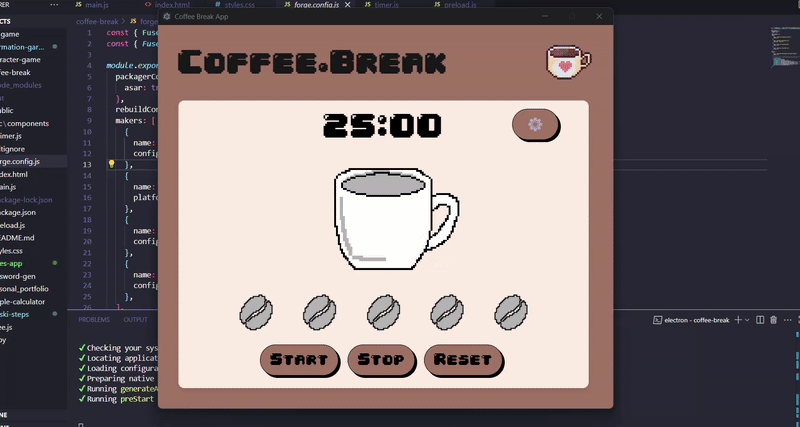

# ☕ coffee.break Pomodoro Timer

A simple, pixel-style desktop Pomodoro timer that helps you stay productive by reminding you when it's time for your well-earned coffee break!

<h1>🎯 Features</h1>

✅ Customizable work durations  
✅ Visual and sound alerts when a session ends  
✅ Minimalist pixel art UI with a cozy coffee theme  
✅ Supports multiple rounds of Pomodoro cycles  
✅ Works offline as a standalone desktop app  

<h1>🚀 Usage</h1>

Set your work session length (default: 25 minutes).

Start the timer and focus on your task.

Enjoy a short break (default: 5 minutes) when the timer alerts you.

Repeat for multiple Pomodoro cycles to maximize productivity!

<h1>📸 App Preview </h1>

<h1>💡 Why Use This Timer?</h1>

Keeps you accountable with clear start and break times  

Encourages healthy work habits with structured breaks!  

Fun, relaxing pixel-art UI makes focusing enjoyable❤️  

<h1>🛠️ Tech Stack</h1>

Frontend: Electron, JavaScript, HTML, CSS

Design: Pixel Art (custom assets)

<h1></h1>

Made with ❤️ and ☕ by Abigail Ferreira
